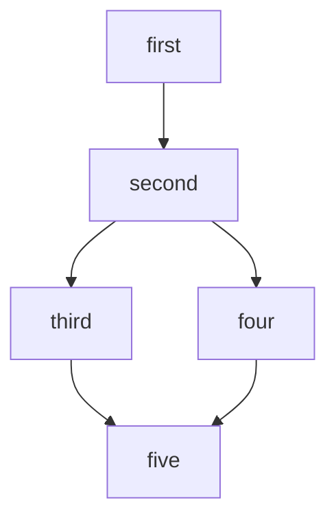

# Flowchart

sample flowchart

```mermaid
graph TB
    first[first]
    second[second]
    third[third]
    four[four]
    five[five]
    first --> second
    second --> third
    second --> four
    third --> five
    four --> five
```
